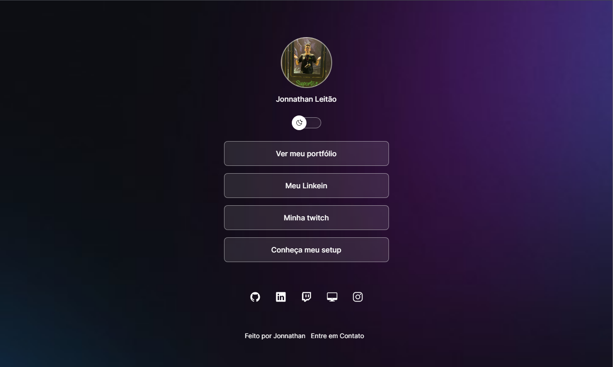

Aplicação desenvolvida no Projeto Discover da Rocketseat e adaptada a meu perfil.

  <a href="#-tecnologias">Tecnologias</a>&nbsp;&nbsp;&nbsp;|&nbsp;&nbsp;&nbsp;
  <a href="#-projeto">Projeto</a>&nbsp;&nbsp;&nbsp;

  

## 🚀 Tecnologias

Esse projeto foi desenvolvido com as seguintes tecnologias:

- HTML
- CSS
- JavaScript
- Git e Github
- Figma

## Projeto

Nesse projeto desenvolvemos a versão simplificada de um sistema de agregação de links para usar como cartão de visitas online, onde você pode colocar um pouco de você e anexar links que estão ligados a você.